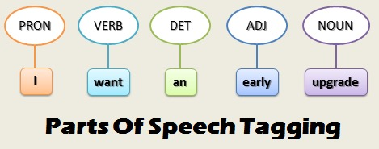

## Part-of-Speech Tagging using Hidden Markov Model

Objective:

Using Viterbi Algorithm and Hidden Markov Models to perform part-of-speech (POS) tagging, the process of assigning a part-of-speech tag (Noun, Verb, Adjective...) to each word in an input text. Tagging is difficult because some words can represent more than one part of speech at different times. For the same reason, it's not possible to develop a deterministic mapping to classify the corresponding tags. Let's start with a few example to illustrate the Ambiguousness.

-   The whole team played **well**. [adverb]

-   You are doing **well** for yourself. [adjective]

-   **Well**, this assignment took me forever to complete. [interjection]

-   The **well** is dry. [noun]

-   Tears were beginning to **well** in her eyes. [verb]

Here are some useful resource:
1. Viterbi algorithm: https://github.com/alejandropuerto/viterbi-HMM-POS-tagging/blob/master/Viterbi_Algorithm.ipynb
2. Introduction to tagging problem: https://princeton-nlp.github.io/cos484/readings/hmms-spring2013.pdf
